# ModSentinel — Demo & Screenshots

> Live on [`r/modsentinel_testing`](https://www.reddit.com/r/modsentinel_testing/comments/1tm9nud/modsentinel_ai_mod_queue/) · App page: [developers.reddit.com/apps/modsentinel-ai](https://developers.reddit.com/apps/modsentinel-ai)

---

## 1. Dashboard — Empty State
Clean start. Queue is empty, health is 100%, filter tabs ready.

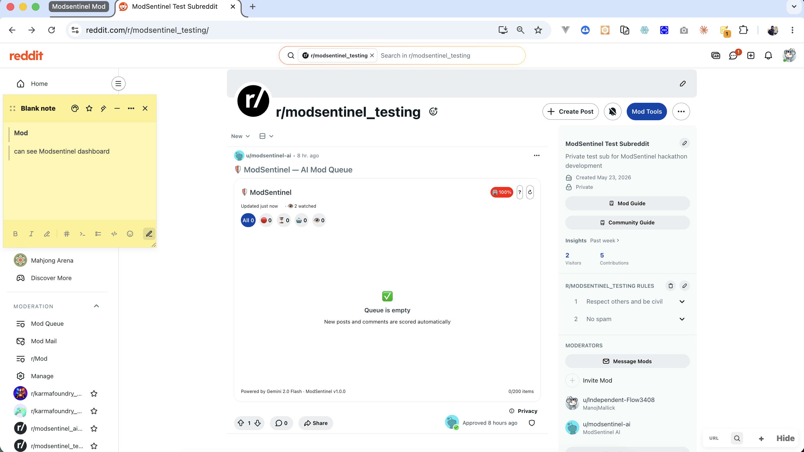

---

## 2. Mod Gate — Non-Moderator Lock Screen
Regular users who open the dashboard see a lock screen. The queue is never exposed to the public.

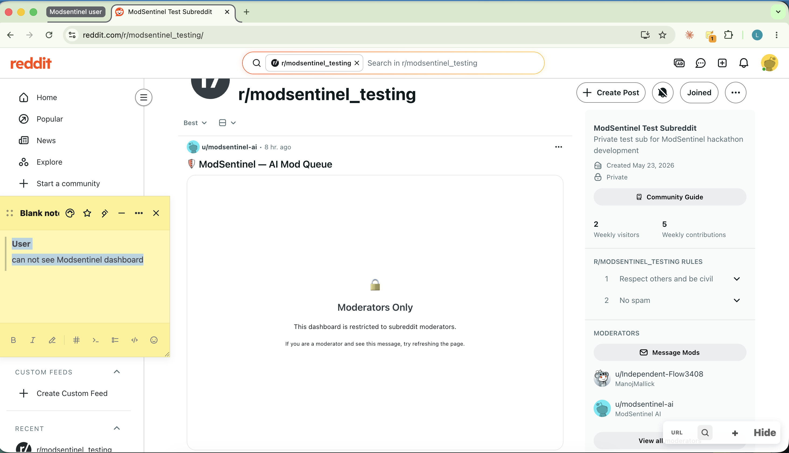

---

## 3. AI Scoring in Action — Approve / Remove / Spam
Gemini 2.0 Flash scores a post in under 3 seconds. Score bars, AI reasoning, and one-tap action buttons.

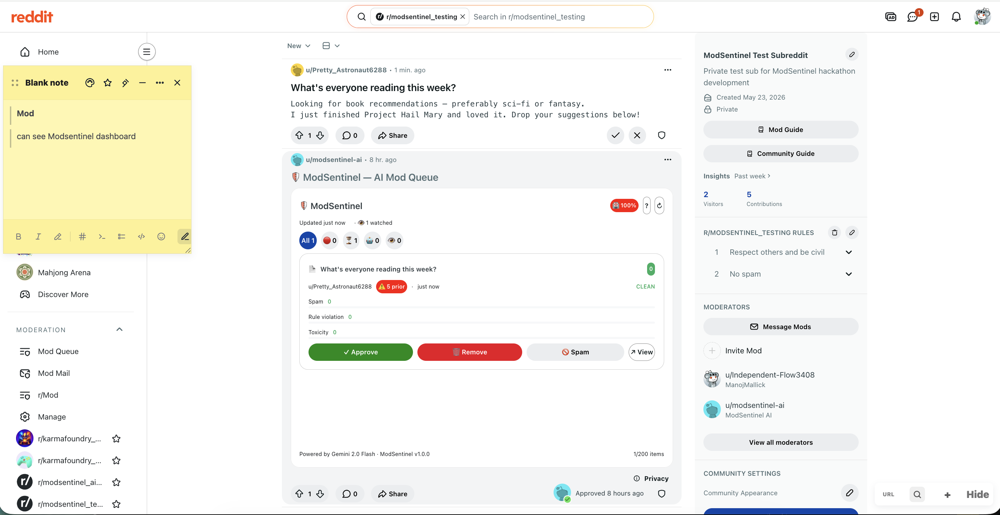

---

## 4. Context Menu Actions
Right-click any post or comment → ModSentinel actions appear inline. No need to open the dashboard.

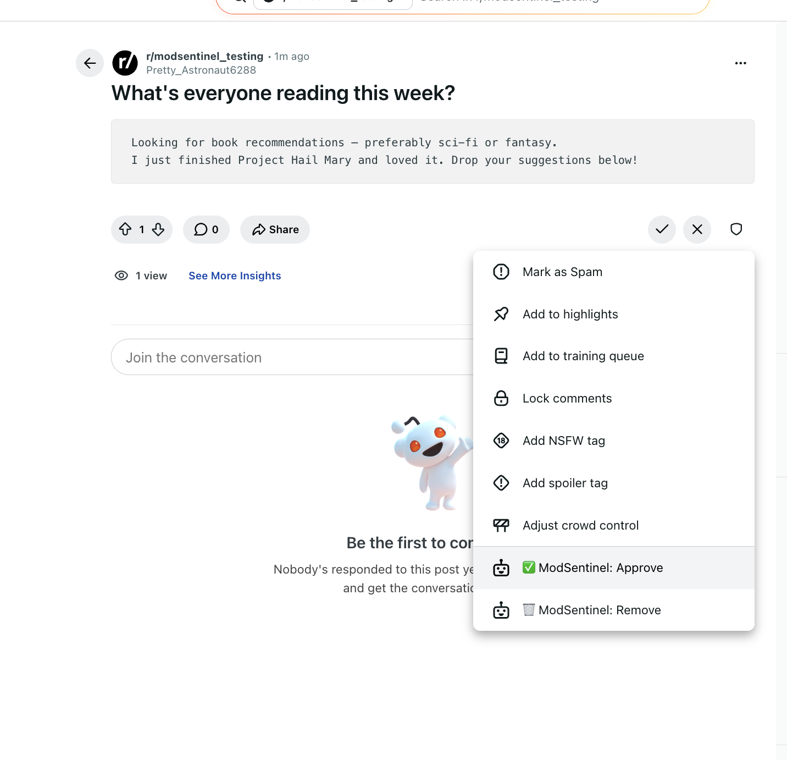

---

## 5. First Item Scored
The dashboard immediately after the first post is created and scored. Priority sorted, pending items first.

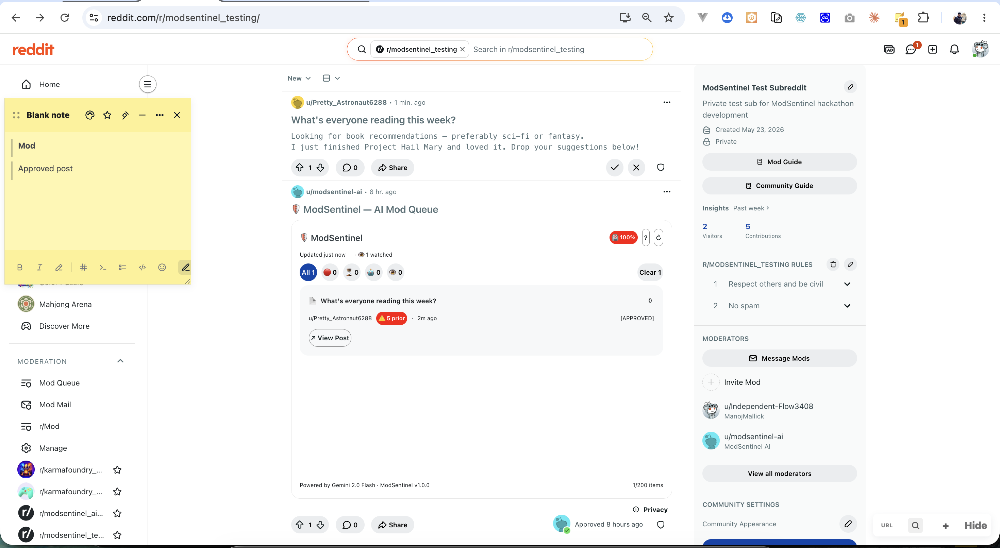

---

## 6. Queue with Mixed Scores
Multiple posts scored — spam (🔴 81), clean posts (🟢 0). Sorted by priority automatically.

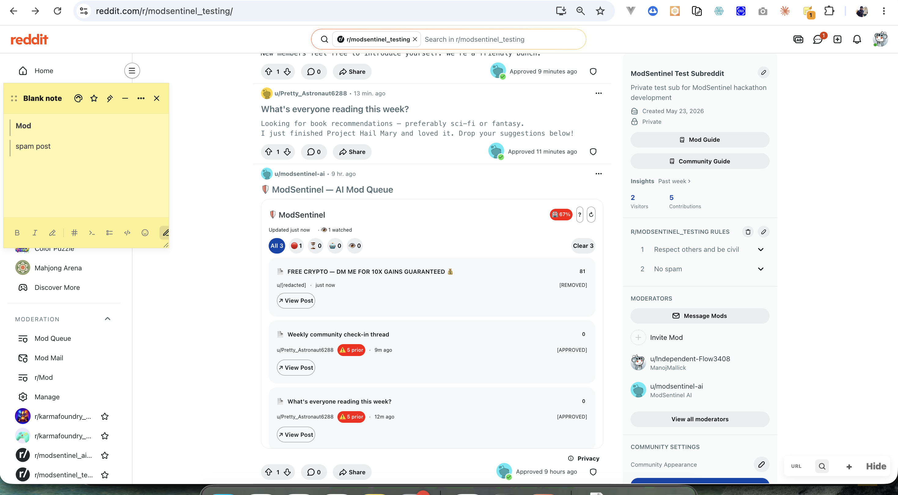

---

## 7. Daily Mod-Mail Report
Automated 9 AM UTC summary sent to subreddit mod-mail: items scored, auto-removed, average risk, community health.

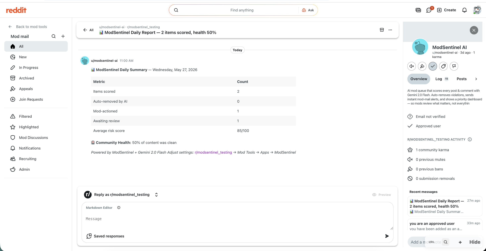

---

## 8. Watchlist — Flagged User
A watchlisted user's post is auto-flagged at score 85 with the 👁 WATCHED badge and a red border — no Gemini call needed.

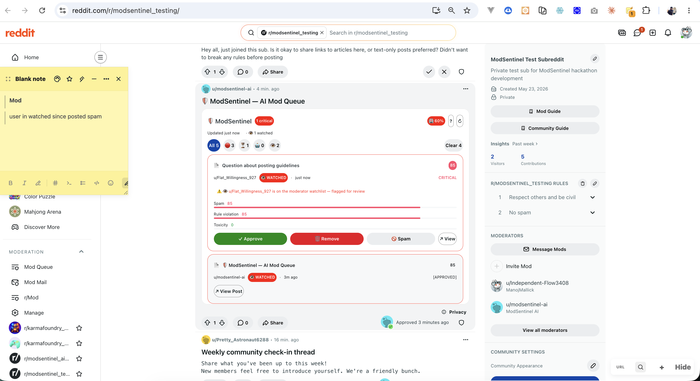

---

## 9. Devvit App Page
The app as it appears on `developers.reddit.com` — in 2 communities, README rendered, Add to community button.

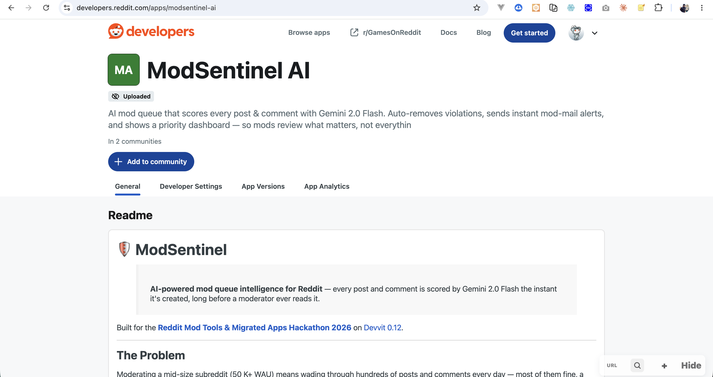

---

## 10. In-App Help Guide
The `?` button opens a built-in reference panel covering score colors, filter tabs, actions, watchlist, and daily reports.

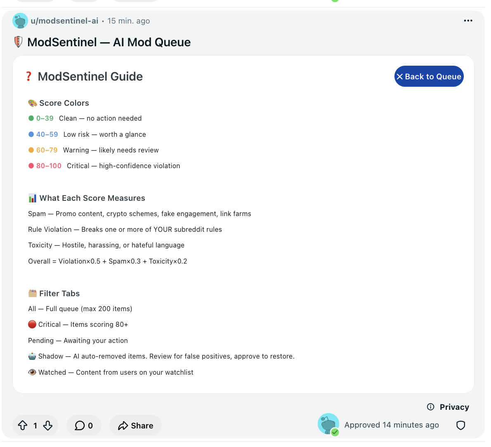

---

## 11. Watched Tab
The 👁 Watched filter tab shows all content from monitored users. "Watching: u/Flat_Willingness_927" shown in the context hint.

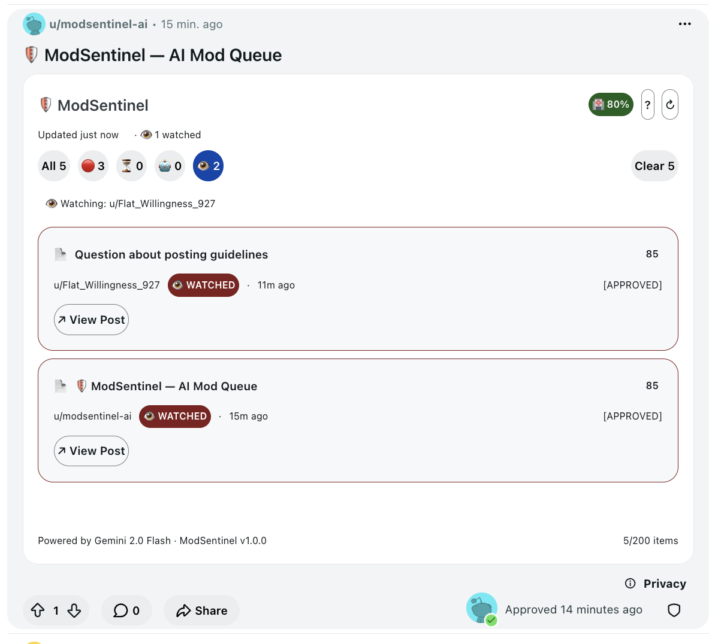

---

## 12. Queue with WATCHED Badges
Multiple items with dark red WATCHED badges — each border highlighted in red, easy to spot at a glance.

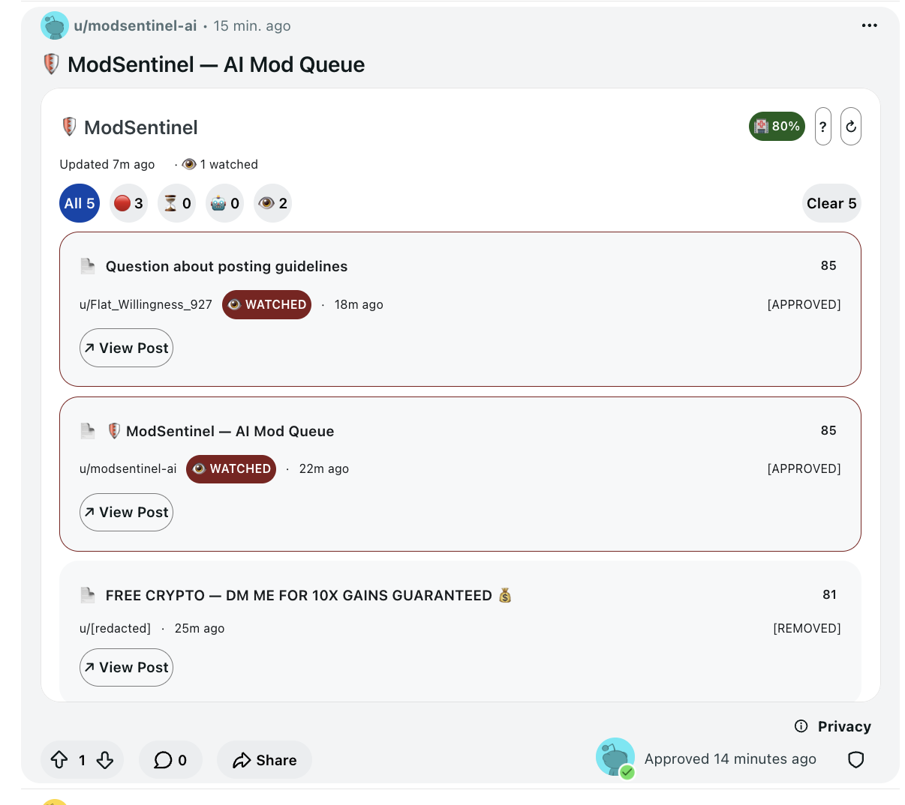

---

## 13. Clean Mobile View — 3 Items
Mobile Reddit app rendering. Header fits with `🏥 80%`, `?`, `↻`. Filter tabs show icon + count.

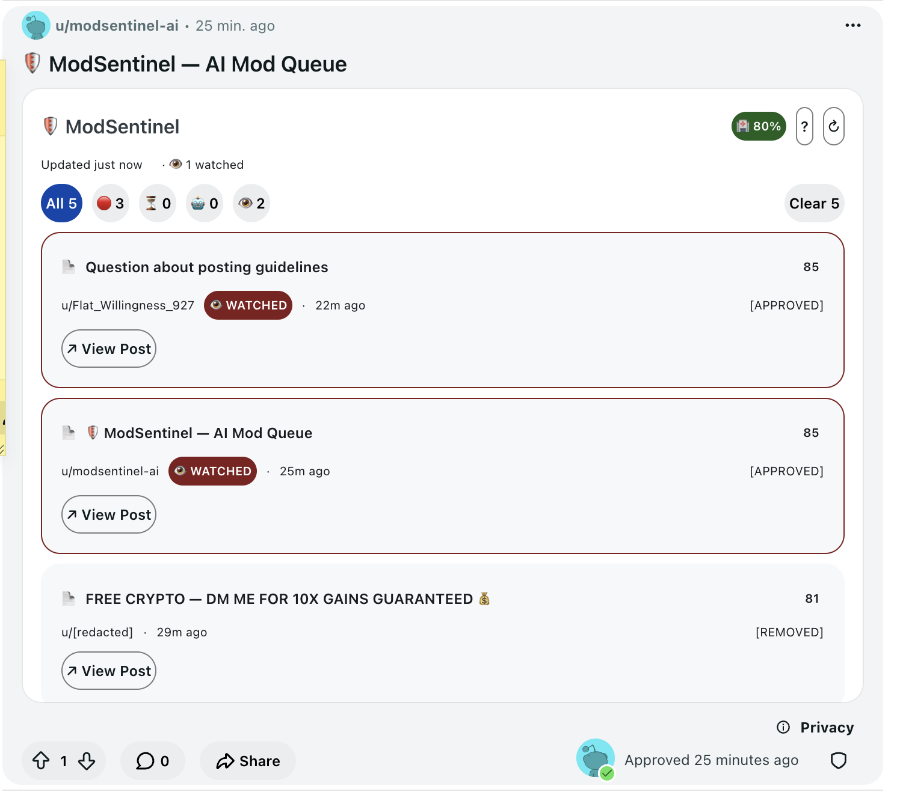

---

## 14. Desktop — Pagination Page 1 of 3
Desktop web view with 5 items, showing page 1/3. `← Prev` disabled, `Next →` active.

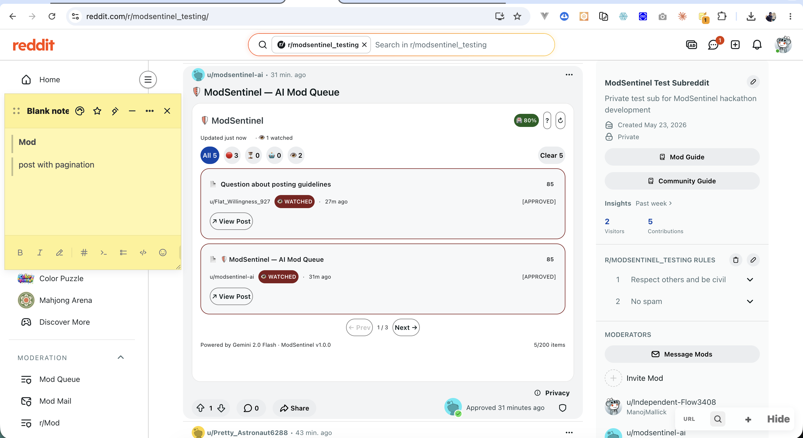

---

## 15. Desktop — Pagination Page 2 of 3
Page 2 with `← Prev` and `Next →` both active. Items with ⚠️ 5 prior reputation badges.

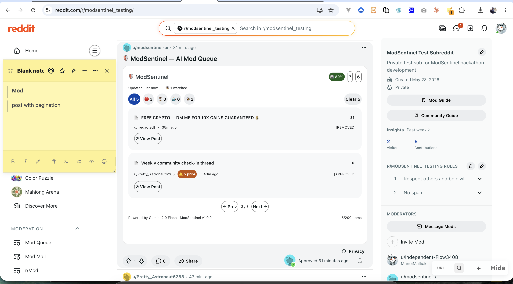

---

## 16. Mobile — Pagination Page 2 of 2
Mobile app showing pagination bar at the bottom: `← Prev  2 / 2  Next →`. Clean, fits within viewport.

---

## 17. Mobile — Full Queue Overview
Mobile overview showing All 5 tab, filter tabs with icon counts, reputation badges, and footer with item count.

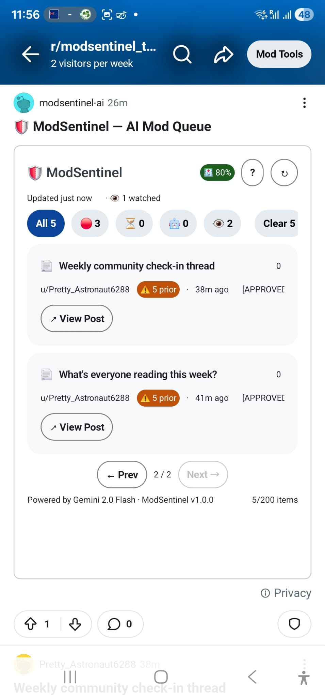

---

## Key Numbers

| Metric | Value |
|--------|-------|
| Time to score a post | < 3 seconds |
| Gemini free tier | 1M tokens/month (~5,000 items) |
| Queue capacity | 200 items |
| Items per page | 2 (desktop + mobile) |
| Auto-remove default | Score ≥ 95 |
| Auto-flair default | Score ≥ 80 |
| Mod-mail alert default | Score ≥ 90 |
| Watchlist flag score | 85 (flags without auto-removing) |
| Daily report time | 9:00 AM UTC |
